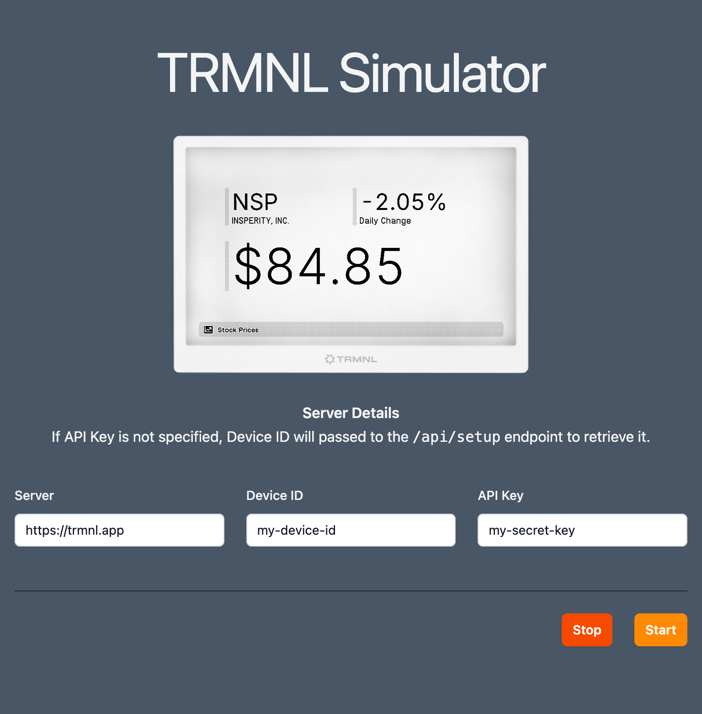

# TRMNL SMLTR
A browser based simulator for the [TRMNL](https://usetrmnl.com/) e-ink message board.

Can be used to test different server implementations or as a virtual device while you wait for your real one to ship!



## Basic Use

Specify the server URL or use the default, fill in your Device ID and optionally API Key, then click start.
The page will make a call to `/api/setup` to get an API key if not specified, then call `/api/display` every X seconds
based on the interval you specified on the portal.

## Advanced Use

You can specify all the fields on the page (or just Device ID) as query params.
The page will automatically begin polling the server when all fields are populated.

Just Device ID
```
https://deisterhold.github.io/trmnl-simulator/?deviceId=your-device-id
```

All Parameters
```
https://deisterhold.github.io/trmnl-simulator/?server=https%3A%2F%2Ftrmnl.app&deviceId=your-device-id&apiKey=your-secret-key
```
